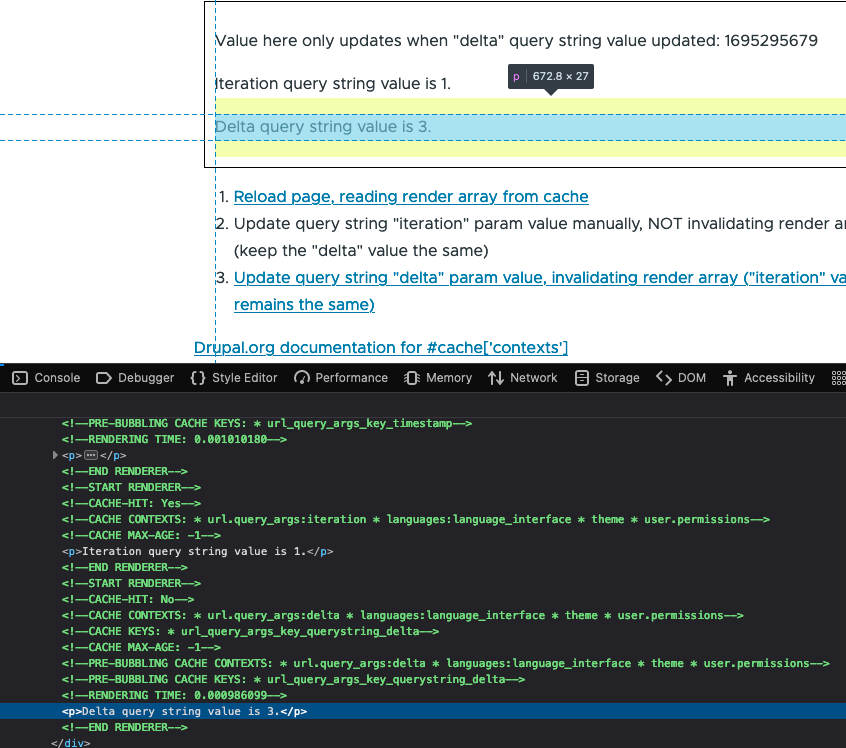

# Hashcache module

A module to try and document/show/explain the behaviours around Drupal render array `#cache` values.

Install/enable the module, the same as any other, then visit the URL `/hashcache`.

The page at that URL contains links to different examples of simple render arrays using `#cache['max-age']`, `#cache['contexts']`, `#cache['tags']` and `#cache['keys']` and tries to explain how they can/do work together.

## Requirements

A default, out of the box Drupal set up is assumed.

Both the 'Internal Page Cache' and 'Dynamic Page Cache' modules enabled, as well as 'BigPipe'.

Configuration change(s) to:

- [Output cache debug headers](https://www.drupal.org/docs/8/api/responses/cacheableresponseinterface#debugging) - `parameters.http.response.debug_cacheability_headers`
- [Enable render cache debug output](https://www.drupal.org/node/3162480) - `parameters.render.config.debug`

## Tips

Open the example(s) in one browser tab as an anonymous user, and then also a private browsing tab as an authenticated user.

In both browser tabs/windows open the developer tools 'Network' tab, so you can see the page requests and the response headers, where the cached response debug headers will be visible.

This should make it easier to understand what's happening when looking at each example route, as the response for both types of user can then be compared side by side.

## Links

The examples (at `/hashcache``) touch a few different subject areas. Below is a collection of a few of the links that were useful/relevant when putting them together:

- https://dev.acquia.com/blog/drupal-8-performance-render-caching
- https://drupalize.me/tutorial/render-api-overview?p=2766
- https://www.drupal.org/docs/theming-drupal/twig-in-drupal/debugging-compiled-twig-templates
- https://support.acquia.com/hc/en-us/articles/360005167754-Drupal-Twig-cache
- https://www.drupal.org/docs/drupal-apis/render-api/auto-placeholdering
- https://api.drupal.org/api/drupal/core%21lib%21Drupal%21Core%21Render%21theme.api.php/group/themeable/9.2.x
- https://www.drupal.org/node/3162480
- https://weknowinc.com/blog/drupal-8-add-cache-metadata-render-arrays

Also these links from Drupalcon Pittsburgh 2023 talks about debugging performance issues, including cache info:

- [Performance Audits - The Top 8 Problems We Find & How To Fix Them](https://www.youtube.com/watch?v=-pBSXCzjGV8)
- [Advanced Render Cache Debugging](https://www.youtube.com/watch?v=OW0AQivO8Bw)

## Example of render cache debug setting output

